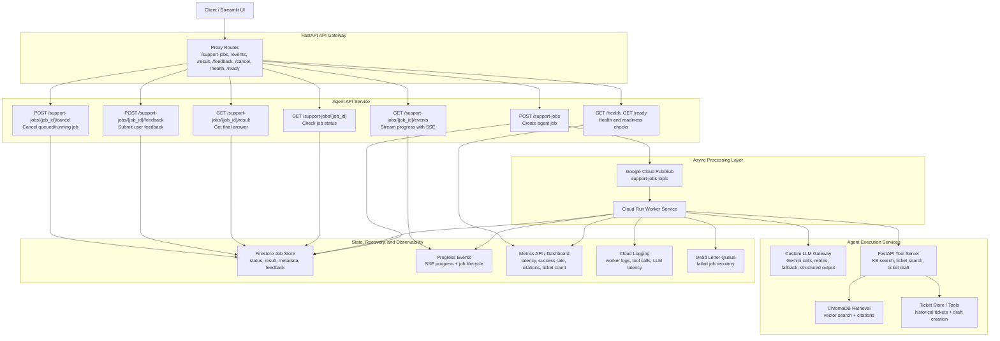

# Enterprise AI Support Platform

> A production-style AI support platform built with FastAPI, Google Cloud Run, Pub/Sub, Firestore, ChromaDB, and Gemini 2.5 Flash.

[]()
[]()
[]()
[]()
[]()
[]()
[]()

---

## Overview

Enterprise AI Support Platform is a cloud-native AI backend system designed to automate enterprise IT support workflows.

Unlike a traditional RAG chatbot, the platform separates request handling, agent execution, tool invocation, and retrieval into independent services connected through asynchronous job processing. This architecture improves scalability, reliability, and fault tolerance while enabling grounded responses with citations, enterprise knowledge retrieval, historical ticket search, and automated ticket drafting.

The entire platform is containerized with Docker, deployed on Google Cloud Run, and integrated with GitHub Actions for automated CI/CD.

---

# Features

## AI Capabilities

- Grounded Retrieval-Augmented Generation (RAG)
- ChromaDB vector search
- Citation-aware responses
- Historical ticket retrieval
- Automatic ticket draft generation
- Structured LLM outputs
- Confidence scoring

---

## Backend Architecture

- FastAPI REST APIs
- API Gateway
- Custom LLM Gateway
- Asynchronous job execution
- Google Cloud Pub/Sub
- Background Worker Service
- Service decoupling
- Firestore persistence
- Retry with exponential backoff
- Dead Letter Queue (DLQ)

---

## Cloud & DevOps

- Dockerized microservices
- Google Cloud Run deployment
- GitHub Actions CI/CD
- Smoke evaluation pipeline
- Health & readiness checks
- Metrics dashboard
- Cloud Logging

---

# System Architecture



---

# Technology Stack

| Layer | Technology |
|---------|------------|
| Frontend | Streamlit |
| API Framework | FastAPI |
| API Gateway | FastAPI |
| LLM | Gemini 2.5 Flash |
| Message Queue | Google Cloud Pub/Sub |
| Background Processing | Cloud Run Worker |
| Vector Database | ChromaDB |
| Database | Firestore |
| Deployment | Google Cloud Run |
| CI/CD | GitHub Actions |
| Containers | Docker |

---

# Project Structure

```
src
├── agent_api
├── api_gateway
├── jobs
├── llm_gateway
├── mcp_server
├── rag
├── tickets
├── ui
├── metrics
└── eval
```

---

# Deployment Pipeline

```text
GitHub Push
      │
      ▼
GitHub Actions
      │
      ▼
Docker Build
      │
      ▼
Artifact Registry
      │
      ▼
Cloud Run
      │
      ├── API Gateway
      ├── Agent API
      ├── Worker
      ├── Tool Server
      └── Streamlit UI
```

---

# Evaluation

The platform includes an automated smoke evaluation pipeline executed during CI/CD.

The evaluation validates:

- Correct tool routing
- Citation generation
- Ticket creation behavior
- Structured LLM outputs
- End-to-end workflow correctness

---

# Screenshots

## Chat Interface

> *(Insert screenshot here)*

---

## Streaming Job Events

> *(Insert screenshot here)*

---

## Dashboard

> *(Insert screenshot here)*

---

# Future Improvements

- Multi-agent workflow orchestration
- Redis caching
- Kubernetes deployment
- Multi-region failover
- Authentication & RBAC
- Tool authorization
- Load testing & benchmarking

---
